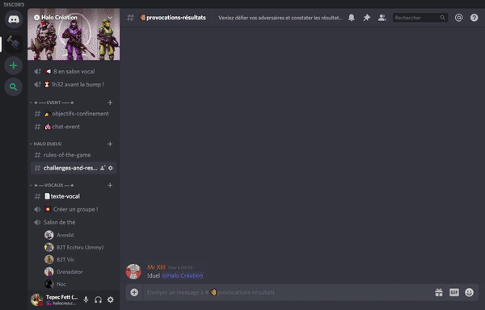

<h1 align="center">Halo Duels ✊</h1>
<p align="center">
  
  
  
  <a href="https://choosealicense.com/licenses/gpl-3.0/" target="_blank">
    
  </a>
  
  <br />
  <a href="https://discord.gg/74UAq84" target="_blank">
    
  </a>
  <a href="https://twitter.com/HaloCreation" target="_blank">
    
  </a>
</p>

<p align="center"></p>

> A Discord Bot to let your servers' members fight some &#34;Halo-themed&#34; duels, full of gifs and funny stuff!

<p align="center"></p>

### 🏠 [Homepage](https://duels.halocrea.com/)
### 🔫 [Demo](https://discord.gg/74UAq84)

## Prerequisites

- [node](https://nodejs.org/en/) >=12.16.1
- [yarn](https://yarnpkg.com) >=1.19.1

## Install 
### With Docker 
A `Dockerfile` is available at the root of the project so you can easily set the bot up without having to care about any global dependency or anything. If you want to do it this way, make sure you have [Docker](https://www.docker.com) installed on your machine.

```bash session
git clone https://github.com/tepec/haloduels.git
cd haloduels

cp .env.dist .env
vi .env
#provide the information required in the .env file

docker build -t haloduels .
docker run -d -v /home/docker/haloduels/saves:/app/saves --restart=always --name=haloduels haloduels
```

### Without Docker
Make sure you have the proper [Node.js](https://nodejs.org/en/) and [Yarn](https://yarnpkg.com) versions installed on your machine.
```bash session
git clone https://github.com/tepec/haloduels.git
cd haloduels

cp .env.dist .env
vi .env
#provide the information required in the .env file

yarn

node index.js
```

### OPTIONAL FEATURE: TWITCH CHANNEL IN BOT STATUS
The bot can automatically change its status from the default one (_"playing halocrea.com"_) to _"streaming %Game%"_ based on the activity of your Twitch channel.

In order to do that, you must provide in the .env file: 
* `TWITCH_CLIENT_ID`: your own Twitch Developer Client ID. To get yours, check [this page](https://dev.twitch.tv/dashboard/apps/create).
* `TWITCH_CHANNEL_ID`: the **ID** of the channel you want to "watch". It's _not_ the name of your channel. To retrieve your channel's ID, you can use the Twitch API's Endpoint `https://api.twitch.tv/kraken/users?login=%YOUR CHANNEL NAME%` (you will need to provide your client ID in the header of the request, check [this page](https://dev.twitch.tv/docs/v5) for more info). 


## Setup 
* If you never set up a Discord bot before, please follow the instructions over [here](https://discordapp.com/developers/docs/intro).
* Once that is done, invite the bot to your server, and type `!duel` to start the installation wizard.

## Supported languages 
* 🇺🇸 English
* 🇫🇷 French

If you'd like to get the bot in another language, feel free to contact us and contribute! 

## Contributing

Contributions, issues and feature requests are welcome!<br />Feel free to check [issues page](https://github.com/tepec/haloduels/issues). 

## Show your support

Give a ⭐️ if this project helped you!
